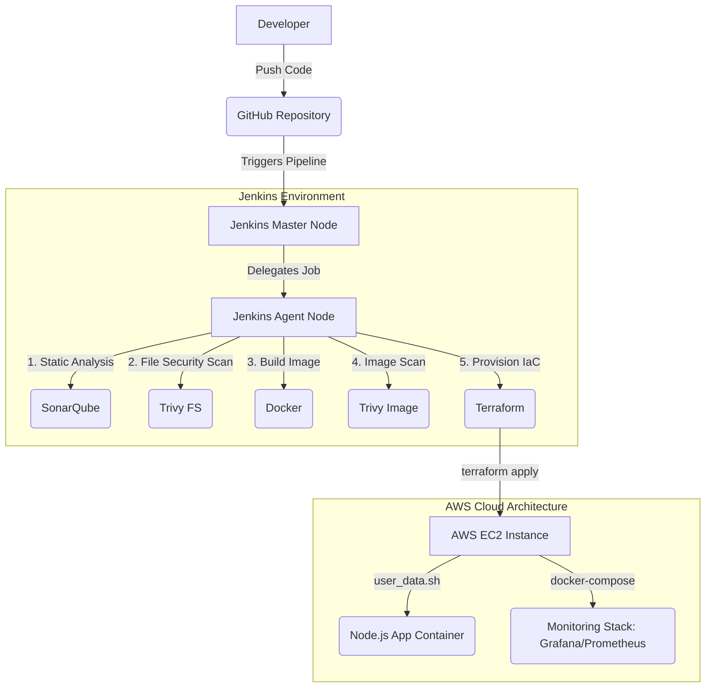

# ExpressHub

ExpressHub is a comprehensive, full-stack food delivery platform built with Node.js and Express. It is designed for containerization with Docker, automated CI/CD with Jenkins, complete Infrastructure as Code (IaC) using Terraform, and built-in observability with Prometheus and Grafana.

This project serves as a robust template for a modern web service, demonstrating a complete development, deployment, and infrastructure lifecycle.

---

## 1) Project Overview

### Project Workflow Architecture



### Tech Stack
- **Backend:** Node.js, Express.js
- **Frontend:** Static HTML, CSS, JavaScript
- **Containerization:** Docker & Docker Compose
- **CI/CD:** Jenkins (Declarative Pipeline)
- **Infrastructure as Code:** Terraform (AWS EC2, Security Groups, Key Pairs)
- **Observability:** Prometheus, Grafana, Node Exporter
- **Security:** Helmet, CORS, Trivy (Image & FS Scanning), SonarQube

### API Endpoints
The backend exposes a RESTful API for managing the platform's core features:
- `GET /api/status` → Health check and service status.
- `POST /api/status` → Test POST endpoint.
- `PUT /api/status` → Test PUT endpoint.
- `/api/menu`, `/api/orders`, `/api/restaurants` → Core feature routes.
- `/*` → Serves the frontend application for any non-API route.

### Repository Structure
- `index.js` → Main Express application entry point.
- `Dockerfile` → Multi-stage Docker build for the Node.js application.
- `Jenkinsfile` → Advanced CI/CD pipeline definition for Jenkins.
- `backend/` & `frontend/` → Application source code.
- `build-process/` → Docker Compose configurations for the monitoring stack.
- `monitoring/` → Prometheus scrape configurations.
- `terraform/` → Terraform environments (`dev/`, `stage/`, `prod/`) and shared modules (`modules/ec2/`).

---

## 2) Prerequisites & VM Configurations

To successfully run this pipeline, you need a specific configuration for your Jenkins Master and Agent VMs (assuming Ubuntu OS):

### Jenkins Master Node
The master node is responsible for orchestration and maintaining credentials.
- **Jenkins Installation:** Installed and running as the `jenkins` user.
- **Plugins Required:** NodeJS, Docker Pipeline, Git, SonarQube Scanner.
- **Credentials:** Store AWS Credentials (`AWS_ACCESS_KEY_ID`, `AWS_SECRET_ACCESS_KEY`) and Grafana Password (`grafana-admin-password`) securely in the Jenkins Credential Manager.
- **Network/SSH:** Must be able to SSH into the Agent Node (exchange `id_rsa.pub` into the Agent's `authorized_keys`).

### Jenkins Agent Node (Ubuntu VM)
The agent node is where the heavy lifting (testing, building, scanning, deploying) happens.
- **User Permissions:** 
  - An active user (e.g., `jenkins` or `ubuntu`) that the Master SSHs into.
  - **Crucial:** The user must be added to the `docker` group to run containers without `sudo`.
    ```bash
    sudo usermod -aG docker $USER
    newgrp docker # (or restart the session)
    sudo chmod 666 /var/run/docker.sock
    ```
- **Tooling to Install:**
  - **Docker Engine:** For building the application container.
  - **Terraform:** Installed and added to system `$PATH` for the deployment stage.
  - **Trivy:** Installed locally for security scanning.
- **Directory Permissions:**
  - Ensure the agent's work directory (`/home/jenkins/workspace` or similar) is owned by the executing user to permit Docker volume mounting and Git operations.

### Target AWS EC2 Instance Permissions
The deployed EC2 instance is configured purely by Terraform and the `user_data.sh` script, meaning **no manual permission config is required** beforehand. However, Terraform relies on the Jenkins Agent's AWS Credentials having the `AmazonEC2FullAccess` (or properly scoped) IAM privileges to create instances, key pairs, and security groups.

---

## 3) Local Development

1. **Clone the Repository**
   ```bash
   git clone https://github.com/poVvisal/ExpressHub.git
   cd ExpressHub
   ```

2. **Install Dependencies**
   ```bash
   npm install
   ```

3. **Run the Application**
   ```bash
   node index.js
   ```
   *The server starts on `http://localhost:3000`.*

---

## 4) Monitoring & Observability Stack

ExpressHub includes a fully configured Docker Compose stack for monitoring the host EC2 instance and the Dockerized Node.js application.

The stack is defined in `build-process/docker-compose.yml` and includes:
- **Prometheus (Port 9090):** Scrapes metrics from the Node Exporter and the application target (`host.docker.internal:3000`).
- **Node Exporter (Port 9100):** Exports host-level hardware and OS metrics.
- **Grafana (Port 5000):** Visualizes the metrics. 

**Accessing Grafana:**
- URL: `http://<ec2-public-ip>:5000`
- Default User: `admin`
- Password: Injected securely by Terraform from Jenkins credentials (`TF_VAR_grafana_password`).

---

## 5) CI/CD Pipeline (Jenkins)

The `Jenkinsfile` orchestrates a secure, automated deployment pipeline with the following stages:

1. **Clone Repository:** Pulls the `main` branch.
2. **SonarQube Analysis:** Runs static code analysis.
3. **Quality Gate:** Enforces code quality thresholds (times out after 10 minutes).
4. **Trivy Filesystem Scan:** Scans the codebase for HIGH/CRITICAL vulnerabilities.
5. **Build Docker Image:** Builds the multi-stage lightweight Alpine image.
6. **Trivy Image Scan:** Scans the compiled Docker image for OS-level vulnerabilities.
7. **Terraform Plan & Apply:** Deploys the infrastructure dynamically to AWS using the `terraform/dev` configuration.

**Failure Handling:** If the pipeline fails during or after the Terraform step, a `post { failure }` block automatically triggers a `terraform destroy` to tear down the broken infrastructure and prevent AWS cost leaks.

---

## 6) Infrastructure as Code (Terraform)

The `terraform/` directory manages AWS EC2 deployments across `dev`, `stage`, and `prod` environments.

### Features
- **Modular Design:** Uses a shared `ec2` module (`terraform/modules/ec2`).
- **Dynamic Configuration:** Supports creating new Security Groups & Key Pairs, or reusing existing ones via variables (`existing_security_group_id`, `existing_key_name`).
- **Automated Bootstrapping:** Injects a `user_data.sh` script into the EC2 instance on boot which automatically installs Docker, pulls the repo, builds the app, and stands up the monitoring stack.

### Manual Deployment
```bash
cd terraform/dev
export TF_VAR_grafana_password="your_secure_password"
# Optional: Reuse existing AWS resources
export TF_VAR_existing_security_group_id="sg-xxxxxxxx"
export TF_VAR_existing_key_name="your_key_name"

terraform init
terraform plan
terraform apply
```

---

## 7) Security Practices Implemented

- **No Hardcoded Secrets:** AWS Keys and admin passwords are provided via Jenkins Credentials (`credentials('grafana-admin-password')`).
- **Least Privilege Execution:** The Dockerfile runs the Node.js application as a non-root `appuser`.
- **Infrastructure Security:** Terraform strictly limits ingress traffic to SSH (22), HTTP (80), App (3000), Grafana (5000), Prometheus (9090), and Node Exporter (9100).
- **Vulnerability Scanning:** Handled automatically by AquaSec Trivy during the CI/CD pipeline.

