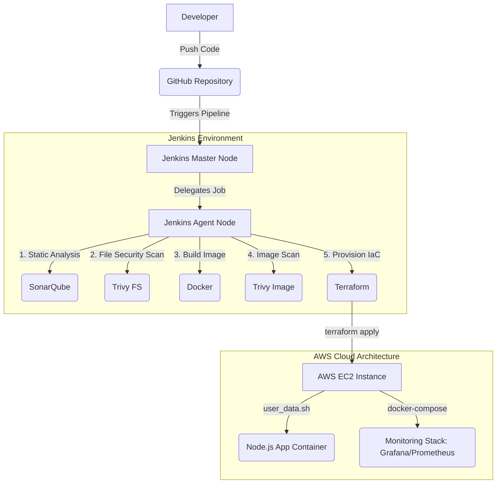

# ExpressHub

ExpressHub is a comprehensive, full-stack food delivery platform built with Node.js and Express. It is designed for containerization with Docker, automated CI/CD with Jenkins, complete Infrastructure as Code (IaC) using Terraform, and built-in observability with Prometheus and Grafana.

This project serves as a robust template for a modern web service, demonstrating a complete development, deployment, and infrastructure lifecycle.

---

## 1) Project Overview

### Project Workflow Architecture



### Tech Stack
- **Backend:** Node.js, Express.js
- **Frontend:** Static HTML, CSS, JavaScript
- **Containerization:** Docker & Docker Compose
- **CI/CD:** Jenkins (Declarative Pipeline)
- **Infrastructure as Code:** Terraform (AWS EC2, Security Groups, Key Pairs)
- **Observability:** Prometheus, Grafana, Node Exporter
- **Security:** Helmet, CORS, Trivy (Image & FS Scanning), SonarQube

### API Endpoints
The backend exposes a RESTful API for managing the platform's core features:
- `GET /api/status` → Health check and service status.
- `POST /api/status` → Test POST endpoint.
- `PUT /api/status` → Test PUT endpoint.
- `/api/menu`, `/api/orders`, `/api/restaurants` → Core feature routes.
- `/*` → Serves the frontend application for any non-API route.

### Repository Structure
- `index.js` → Main Express application entry point.
- `Dockerfile` → Multi-stage Docker build for the Node.js application.
- `Jenkinsfile` → Advanced CI/CD pipeline definition for Jenkins.
- `backend/` & `frontend/` → Application source code.
- `build-process/` → Docker Compose configurations for the monitoring stack.
- `monitoring/` → Prometheus scrape configurations.
- `terraform/` → Terraform environments (`dev/`, `stage/`, `prod/`) and shared modules (`modules/ec2/`).

---

## 2) Prerequisites & VM Configurations

To successfully run this pipeline, you need a specific configuration for your Jenkins Master and Agent VMs (assuming Ubuntu OS):

### Jenkins Master Node
The master node is responsible for orchestration and maintaining credentials.
- **Jenkins Installation:** Installed and running as the `jenkins` user.
- **Plugins Required:** NodeJS, Docker Pipeline, Git, SonarQube Scanner.
- **Credentials:** Store AWS Credentials (`AWS_ACCESS_KEY_ID`, `AWS_SECRET_ACCESS_KEY`) and Grafana Password (`grafana-admin-password`) securely in the Jenkins Credential Manager.
- **Network/SSH:** Must be able to SSH into the Agent Node (exchange `id_rsa.pub` into the Agent's `authorized_keys`).

### Jenkins Agent Node (Ubuntu VM)
The agent node is where the heavy lifting (testing, building, scanning, deploying) happens.
- **User Permissions:** 
  - An active user (e.g., `jenkins` or `ubuntu`) that the Master SSHs into.
  - **Crucial:** The user must be added to the `docker` group to run containers without `sudo`.
    ```bash
    sudo usermod -aG docker $USER
    newgrp docker # (or restart the session)
    sudo chmod 666 /var/run/docker.sock
    ```
- **Tooling to Install:**
  - **Docker Engine:** For building the application container.
  - **Terraform:** Installed and added to system `$PATH` for the deployment stage.
  - **Trivy:** Installed locally for security scanning.
- **Directory Permissions:**
  - Ensure the agent's work directory (`/home/jenkins/workspace` or similar) is owned by the executing user to permit Docker volume mounting and Git operations.

### Target AWS EC2 Instance Permissions
The deployed EC2 instance is configured purely by Terraform and the `user_data.sh` script, meaning **no manual permission config is required** beforehand. However, Terraform relies on the Jenkins Agent's AWS Credentials having the `AmazonEC2FullAccess` (or properly scoped) IAM privileges to create instances, key pairs, and security groups.

---

## 3) Local Development

1. **Clone the Repository**
   ```bash
   git clone https://github.com/poVvisal/ExpressHub.git
   cd ExpressHub
   ```

2. **Install Dependencies**
   ```bash
   npm install
   ```

3. **Run the Application**
   ```bash
   node index.js
   ```
   *The server starts on `http://localhost:3000`.*

---

## 4) Monitoring & Observability Stack

ExpressHub includes a fully configured Docker Compose stack for monitoring the host EC2 instance and the Dockerized Node.js application.

The stack is defined in `build-process/docker-compose.yml` and includes:
- **Prometheus (Port 9090):** Scrapes metrics from the Node Exporter and the application target (`host.docker.internal:3000`).
- **Node Exporter (Port 9100):** Exports host-level hardware and OS metrics.
- **Grafana (Port 5000):** Visualizes the metrics. 

**Accessing Grafana:**
- URL: `http://<ec2-public-ip>:5000`
- Default User: `admin`
- Password: Injected securely by Terraform from Jenkins credentials (`TF_VAR_grafana_password`).

---

## 5) CI/CD Pipeline (Jenkins)

The `Jenkinsfile` orchestrates a secure, automated deployment pipeline with the following stages:

1. **Clone Repository:** Pulls the `main` branch.
2. **SonarQube Analysis:** Runs static code analysis.
3. **Quality Gate:** Enforces code quality thresholds (times out after 10 minutes).
4. **Trivy Filesystem Scan:** Scans the codebase for HIGH/CRITICAL vulnerabilities.
5. **Build Docker Image:** Builds the multi-stage lightweight Alpine image.
6. **Trivy Image Scan:** Scans the compiled Docker image for OS-level vulnerabilities.
7. **Terraform Plan & Apply:** Deploys the infrastructure dynamically to AWS using the `terraform/dev` configuration.

**Failure Handling:** If the pipeline fails during or after the Terraform step, a `post { failure }` block automatically triggers a `terraform destroy` to tear down the broken infrastructure and prevent AWS cost leaks.

---

## 6) Infrastructure as Code (Terraform)

The `terraform/` directory manages AWS EC2 deployments across `dev`, `stage`, and `prod` environments.

### Features
- **Modular Design:** Uses a shared `ec2` module (`terraform/modules/ec2`).
- **Dynamic Configuration:** Supports creating new Security Groups & Key Pairs, or reusing existing ones via variables (`existing_security_group_id`, `existing_key_name`).
- **Automated Bootstrapping:** Injects a `user_data.sh` script into the EC2 instance on boot which automatically installs Docker, pulls the repo, builds the app, and stands up the monitoring stack.

### Manual Deployment
```bash
cd terraform/dev
export TF_VAR_grafana_password="your_secure_password"
# Optional: Reuse existing AWS resources
export TF_VAR_existing_security_group_id="sg-xxxxxxxx"
export TF_VAR_existing_key_name="your_key_name"

terraform init
terraform plan
terraform apply
```

---

## 7) Security Practices Implemented

- **No Hardcoded Secrets:** AWS Keys and admin passwords are provided via Jenkins Credentials (`credentials('grafana-admin-password')`).
- **Least Privilege Execution:** The Dockerfile runs the Node.js application as a non-root `appuser`.
- **Infrastructure Security:** Terraform strictly limits ingress traffic to SSH (22), HTTP (80), App (3000), Grafana (5000), Prometheus (9090), and Node Exporter (9100).
- **Vulnerability Scanning:** Handled automatically by AquaSec Trivy during the CI/CD pipeline.

---

## 8) API Documentation

### Core Endpoints

#### Health Check & Status
- **GET /api/status** → Returns the service health status.
  - Response: `200 OK` with status information.
  
- **POST /api/status** → Echo test endpoint for POST requests.
  - Response: `200 OK` with request data.
  
- **PUT /api/status** → Echo test endpoint for PUT requests.
  - Response: `200 OK` with updated data.

#### Restaurant Management
- **GET /api/restaurants** → Retrieves all available restaurants.
  - Query Parameters: `?sort=name&limit=10` (optional filtering)
  - Response: List of restaurant objects.
  
- **GET /api/restaurants/:id** → Retrieves a specific restaurant by ID.
  - Response: Restaurant object with details.

#### Menu Operations
- **GET /api/menu** → Retrieves menu items.
  - Query Parameters: `?restaurantId=123&category=entrees`
  - Response: List of menu items.
  
- **GET /api/menu/:itemId** → Retrieves a specific menu item.
  - Response: Menu item details with pricing.

#### Order Management
- **GET /api/orders** → Retrieves all orders for the authenticated user.
  - Response: List of order objects with timestamps.
  
- **POST /api/orders** → Creates a new order.
  - Request Body: `{ restaurantId, items: [...], delivery_address }`
  - Response: `201 Created` with order ID and tracking details.
  
- **GET /api/orders/:orderId** → Retrieves order status and details.
  - Response: Order object with current status.
  
- **PUT /api/orders/:orderId** → Updates order status (admin/restaurant only).
  - Response: Updated order object.

#### Frontend Routes
- **GET /\*** → Serves the frontend Single Page Application (SPA).

---

## 9) Environment Variables

ExpressHub uses environment variables for configuration. Create a `.env` file in the project root:

```env
# Application Configuration
NODE_ENV=development
PORT=3000
APP_NAME=ExpressHub

# AWS Configuration (when running outside Jenkins)
AWS_REGION=us-east-1
AWS_ACCESS_KEY_ID=your_access_key
AWS_SECRET_ACCESS_KEY=your_secret_key

# Database Configuration (if applicable)
DB_HOST=localhost
DB_PORT=5432
DB_NAME=expresshub
DB_USER=dbuser
DB_PASSWORD=dbpassword

# Monitoring Configuration
PROMETHEUS_ENABLED=true
METRICS_PORT=9090

# Grafana Configuration
GRAFANA_ADMIN_USER=admin
GRAFANA_ADMIN_PASSWORD=your_secure_password

# Feature Flags
ENABLE_ANALYTICS=true
ENABLE_NOTIFICATIONS=false
```

**Note:** Never commit `.env` files to version control. Use Jenkins credentials or AWS Secrets Manager in production.

---

## 10) Docker & Containerization

### Building Locally
```bash
# Build the Docker image
docker build -t expresshub-app:latest .

# Build with a specific tag
docker build -t expresshub-app:v1.0.0 .
```

### Running the Container
```bash
# Run in development mode
docker run -d \
  --name expresshub-dev \
  -p 3000:3000 \
  -e NODE_ENV=development \
  expresshub-app:latest

# Run with volume mounting for live development
docker run -d \
  --name expresshub-dev \
  -p 3000:3000 \
  -v $(pwd):/app \
  expresshub-app:latest

# Access the application
curl http://localhost:3000
```

### Docker Compose for Full Stack
```bash
# Start the entire monitoring stack
cd build-process
docker-compose up -d

# View logs
docker-compose logs -f

# Stop services
docker-compose down
```

### Image Information
- **Base Image:** Alpine Linux (lightweight and secure)
- **Final Image Size:** ~150 MB (multi-stage optimized)
- **Non-root User:** Runs as `appuser` for enhanced security

---

## 11) Testing

### Running Unit Tests
```bash
# Install test dependencies
npm install --save-dev jest supertest

# Run tests
npm test

# Run tests with coverage
npm run test:coverage

# Run tests in watch mode
npm run test:watch
```

### Manual Testing with cURL
```bash
# Test health endpoint
curl http://localhost:3000/api/status

# Test GET restaurants
curl http://localhost:3000/api/restaurants

# Test POST order creation
curl -X POST http://localhost:3000/api/orders \
  -H "Content-Type: application/json" \
  -d '{
    "restaurantId": "123",
    "items": ["item1", "item2"],
    "delivery_address": "123 Main St"
  }'
```

### Load Testing
```bash
# Using Apache Bench
ab -n 1000 -c 10 http://localhost:3000/api/status

# Using wrk (install from https://github.com/wg/wrk)
wrk -t4 -c100 -d30s http://localhost:3000/api/status
```

---

## 12) Troubleshooting Guide

### Common Issues & Solutions

#### **Pipeline Fails During Terraform Apply**
- **Symptom:** `terraform apply` fails with AWS credential errors.
- **Solution:** Verify AWS credentials are stored in Jenkins Credentials Manager, not hardcoded in the Jenkinsfile.
- **Check:** `echo $AWS_ACCESS_KEY_ID` in Jenkins logs (should be masked).

#### **Docker Image Build Fails**
- **Symptom:** `COPY failed: file not found` or permission denied.
- **Solution:** Ensure Docker daemon is running and the agent user is in the `docker` group.
  ```bash
  sudo usermod -aG docker $USER
  sudo systemctl restart docker
  ```

#### **EC2 Instance Not Reachable via SSH**
- **Symptom:** Pipeline timeout on "Wait for EC2 SSH" stage.
- **Solution:** 
  - Check security group rules allow SSH (port 22) from Jenkins Agent IP.
  - Verify EC2 instance was created: `aws ec2 describe-instances --region us-east-1`
  - Check EC2 logs: `AWS Console > EC2 > Instances > Instance Details > System Log`

#### **Grafana Dashboard Empty (No Metrics)**
- **Symptom:** Prometheus shows targets as DOWN.
- **Solution:**
  - Verify Node Exporter is running on EC2: `curl http://localhost:9100/metrics`
  - Check Prometheus config: `/etc/prometheus/prometheus.yml`
  - Restart containers: `docker-compose restart prometheus node-exporter grafana`

#### **High Memory Usage in Terraform Cache**
- **Symptom:** Jenkins agent disk space full.
- **Solution:** The pipeline automatically cleans cache directories older than 7–30 days (see `post { always }` block). Manually clear:
  ```bash
  rm -rf /var/lib/jenkins/.terraform.d/plugin-cache/*
  docker system prune -a
  ```

#### **Application Crashes on EC2**
- **Symptom:** Container exits immediately.
- **Solution:**
  1. SSH into EC2 and check Docker logs:
     ```bash
     docker logs -f foodexpress-js
     ```
  2. Verify environment variables are set:
     ```bash
     docker ps --format "table {{.Names}}\t{{.Status}}"
     ```
  3. Check Node Exporter isn't conflicting on port 9100.

---

## 13) Scaling & Performance

### Horizontal Scaling
- **Load Balancer:** Use AWS Application Load Balancer (ALB) to distribute traffic across multiple EC2 instances running ExpressHub.
- **Auto Scaling Group:** Configure Terraform to create an ASG with launch templates for automatic scaling based on CPU/memory metrics.
- **Multi-Environment Deployment:** Deploy to `prod/` and `stage/` environments in parallel for high availability.

### Vertical Scaling
- Update EC2 instance type in `terraform/dev/terraform.tfvars`:
  ```hcl
  instance_type = "t3.large"  # Upgrade from t3.micro
  ```
- Reapply Terraform: `terraform apply`

### Database Optimization
- Add database indexing on frequently queried fields (restaurantId, orderId, userId).
- Implement query caching with Redis.
- Use connection pooling for database connections.

### Monitoring Performance
- Track response times via Grafana dashboards.
- Set up alarms for high latency (>500ms) or error rates (>5%).
- Use APM tools (e.g., New Relic, DataDog) for deeper insights.

---

## 14) Deployment Strategies

### Blue-Green Deployment
The pipeline implements a form of blue-green deployment:
1. Old container renamed to `foodexpress-js-previous`.
2. New container starts as `foodexpress-js`.
3. If new container fails health checks, automatic rollback occurs.

### Canary Deployment
To implement canary deployments:
1. Deploy new version to a subset of EC2 instances (e.g., 1 out of 10).
2. Monitor metrics for 30 minutes.
3. Gradually roll out to remaining instances if stable.

### Rolling Updates
- Modify deployment script in Jenkinsfile to deploy in waves.
- Use container orchestration (Kubernetes) for advanced rolling updates.

---

## 15) Roadmap & Future Enhancements

### Planned Features
- [ ] **Kubernetes Migration:** Replace EC2 deployment with EKS for better scalability.
- [ ] **Real-time Notifications:** Implement WebSocket support for live order tracking.
- [ ] **Payment Integration:** Stripe or PayPal for online payments.
- [ ] **Multi-Region Support:** Replicate infrastructure across AWS regions.
- [ ] **API Rate Limiting:** Implement token bucket algorithm to prevent abuse.
- [ ] **User Authentication:** OAuth2 integration (Google, GitHub sign-in).
- [ ] **Admin Dashboard:** Comprehensive analytics and reporting system.
- [ ] **Mobile App:** React Native or Flutter client applications.

### Infrastructure Improvements
- [ ] **Terraform Remote State:** Migrate from local state to S3 + DynamoDB.
- [ ] **GitOps Pipeline:** Implement ArgoCD for declarative deployments.
- [ ] **Vault Integration:** Use HashiCorp Vault for secret management.
- [ ] **Cross-Region Replication:** Set up RDS read replicas for disaster recovery.

---

## 16) Contributing

We welcome contributions! Please follow these guidelines:

1. **Fork the Repository**
   ```bash
   git clone https://github.com/yourusername/ExpressHub.git
   cd ExpressHub
   git checkout -b feature/your-feature-name
   ```

2. **Make Changes**
   - Follow existing code style and conventions.
   - Add tests for new features.
   - Update documentation as needed.

3. **Commit & Push**
   ```bash
   git add .
   git commit -m "feat: add your feature description"
   git push origin feature/your-feature-name
   ```

4. **Create a Pull Request**
   - Provide a clear description of changes.
   - Link related issues.
   - Ensure all CI/CD checks pass.

### Code Style
- **JavaScript:** Use ESLint (config: `.eslintrc.json`)
- **Formatting:** Use Prettier for consistent formatting
- **Comments:** Document complex logic with JSDoc comments

---

## 17) Frequently Asked Questions (FAQ)

**Q: Can I use a different CI/CD tool (GitLab CI, GitHub Actions)?**  
A: Yes! The pipeline logic is tool-agnostic. Translate the Jenkinsfile stages to your preferred platform.

**Q: How do I manage multiple environments?**  
A: Use Terraform workspaces or separate `tfvars` files for `dev/`, `stage/`, and `prod/`.

**Q: What's the estimated AWS cost per month?**  
A: For a `t3.micro` instance with monitoring, expect $10–20/month. Costs scale with instance type and data transfer.

**Q: Can I run this locally without Docker?**  
A: Yes! Just run `npm install && node index.js`. Docker is optional but recommended for consistency.

**Q: How do I enable debug logging?**  
A: Set `DEBUG=*` or `NODE_DEBUG=*` environment variable before starting the app.

**Q: What happens if the EC2 instance runs out of disk space?**  
A: Docker containers will fail to start. Increase the EBS volume size in Terraform and reapply.

---

## 18) Support & Contact

For issues, questions, or suggestions:

- **GitHub Issues:** [ExpressHub Issues](https://github.com/poVvisal/ExpressHub/issues)
- **Email:** Contact the maintainers for security issues or urgent matters.
- **Discussions:** Use GitHub Discussions for general questions and ideas.

### Reporting Bugs
Please include:
- Steps to reproduce the issue
- Expected vs. actual behavior
- Environment details (OS, Node version, Jenkins version)
- Relevant logs or screenshots

---

## License

ExpressHub is licensed under the [MIT License](LICENSE). Feel free to use, modify, and distribute this project in accordance with the license terms.

